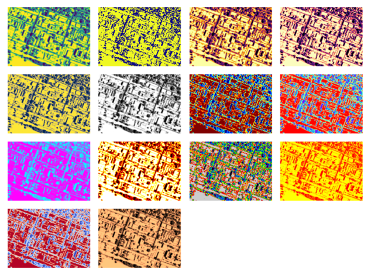

# AWS Demo: A1 Shadow Analysis

## Overview

This project demonstrates a shadow analysis API hosted on AWS, utilizing a combination of technologies for analyzing shadows, storing results, and providing visualizations. The API allows users to trigger shadow analysis and obtain shadow matrices.

## API Usage

### How to Trigger

You can trigger the API either via the terminal or using Python.

#### Trigger in Terminal:

```bash
curl https://iqf1uezcub.execute-api.us-east-1.amazonaws.com/stage/run_a1_shadow_analysis
```

#### Trigger in Python:

```python
import requests
API_URL = 'https://iqf1uezcub.execute-api.us-east-1.amazonaws.com/stage/run_a1_shadow_analysis'
response = requests.get(API_URL)
```

## Request

Method: GET

URL: https://iqf1uezcub.execute-api.us-east-1.amazonaws.com/stage/run_a1_shadow_analysis


## Response
The response to the API call is a JSON file in the following format:
```json
{
  "Message": "Request was successful!",
  "Timestamp": "2023-10-16 09:45",
  "ShadowMatrix": [[889], [1228], "This is a 2D array of shape 889 * 1228"]
}
```

# Architecture


# Detailed design documentation

1. Containerization

The Python application is containerized into a Docker image exposed on port 56789. 

You can find the container on Docker Hub at zhenglinli9875/a1-shadow-analysis-python.

2. Host on AWS

The program runs on an EC2 instance as the API backend server, ensuring scalability and reliability.

2. Shadow Analysis

Shadow analysis is performed based on the timestamp of the API call in the Central Timezone (CT), generating a shadow matrix.


3. Storing Results in MongoDB

Upon generating the shadow matrix, the results are stored in MongoDB Atlas. This includes timestamps and the generated 2D arrays.

4. Visualization

When the user call the API, they will get a json response.

In the json response, users are able to extract the 2d array shadow matrix.

In the `demo.ipynb`, I visualize the shadow matrix effectively.




4. Validation

When users call the API, they receive a JSON response. They can extract the shadow matrix from this response. 

To provide a visual representation of the shadow matrix, the project includes a demo.ipynb notebook.